# Digital USB Oscilloscope

A simple 2-channel USB oscilloscope built around an **ESP32-S3** and an **AD9288** ADC (100 MSPS per channel). The board samples the signal, sends the data over USB to a PC, and a Windows app draws the waveform.

Made as a high-school SOČ project (2025).

<p align="center">
  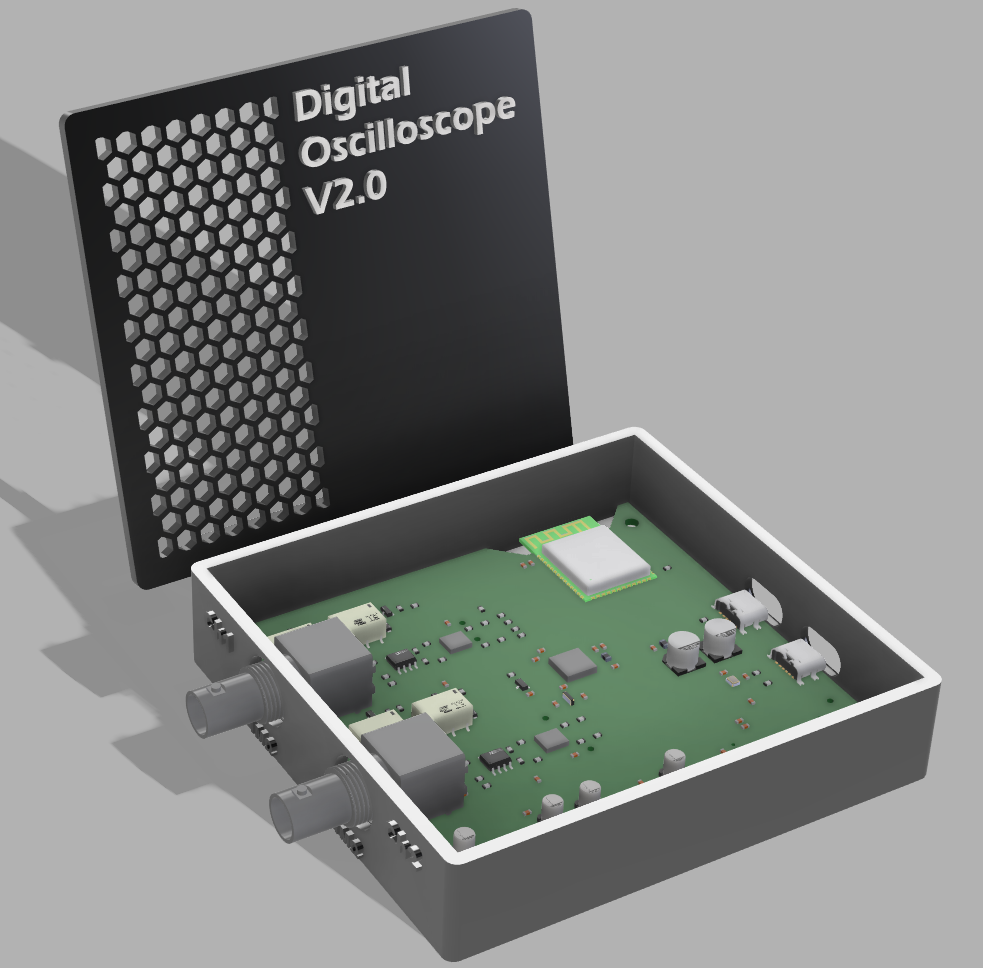
  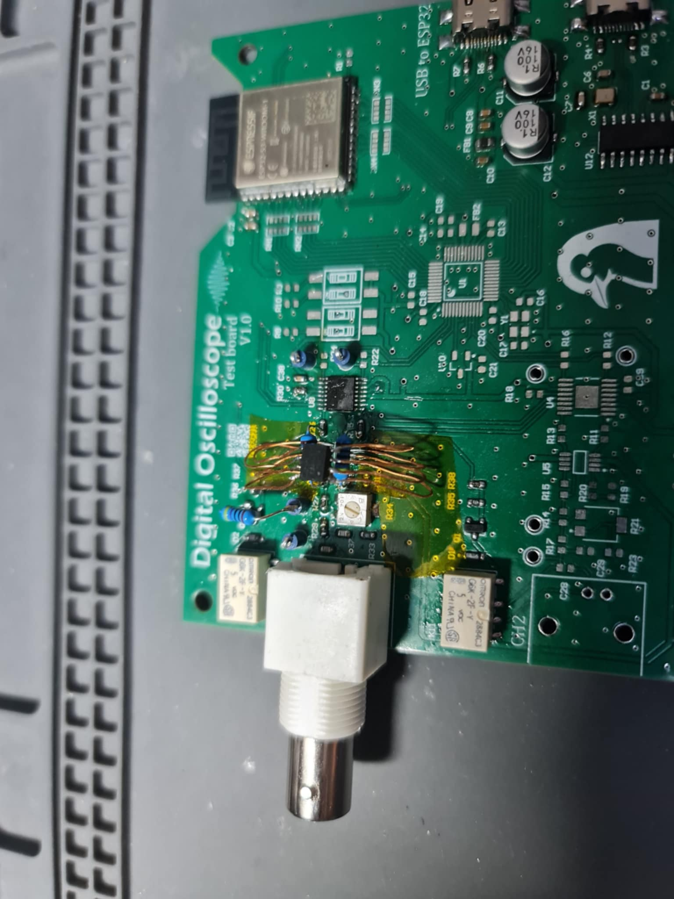
</p>
<p align="center"><i>Left: V2.0 in its 3D-printed case (render). Right: V1.0 test board.</i></p>

## Features

- 2 channels, BNC inputs
- AD9288 dual 8-bit ADC, up to 100 MSPS per channel
- x1 / x10 input range switched by relays
- Adjustable gain per channel (V/div) and time base (s/div)
- Powered and connected over USB-C
- PC app with live waveform display, min/max readout and optional smoothing

## How it works

```
BNC in → x1/x10 relays → AD8138 (diff. driver) → AD8370 (VGA) → AD9288 ADC → ESP32-S3 → USB-UART (CH340) → PC app
```

1. The input signal goes through a relay-switched attenuator (x1 / x10).
2. The **AD8138** converts it to a differential signal and the **AD8370** variable-gain amplifier scales it so it fits the ADC's 1 Vpp input.
3. The **AD9288** samples both channels; the **ESP32-S3** reads the samples in parallel through its GPIOs.
4. The ESP32 sends the data over UART (460800 baud) through a CH340 USB bridge.
5. The PC app sets the COM port, time base and V/div, and draws the received samples.

Power comes from the USB 5 V. LDOs make 3.3 V for the ESP32 and ADC, and a DC-DC boost to 12 V followed by regulators makes the ±5 V for the ADC driver.

## Schematic

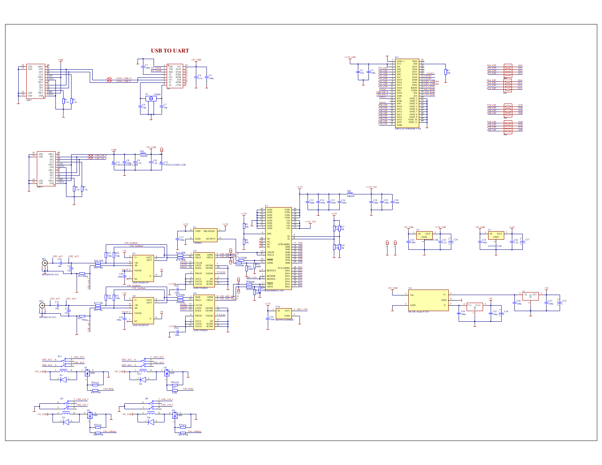

Full Altium projects (schematic, PCB, 3D model, assembly drawings) are in [`PCBs/`](PCBs/).

## Simulation

The input stage was simulated in SPICE before building the board, in both x1 and x10 mode.

| x1 | x10 |
|---|---|
| 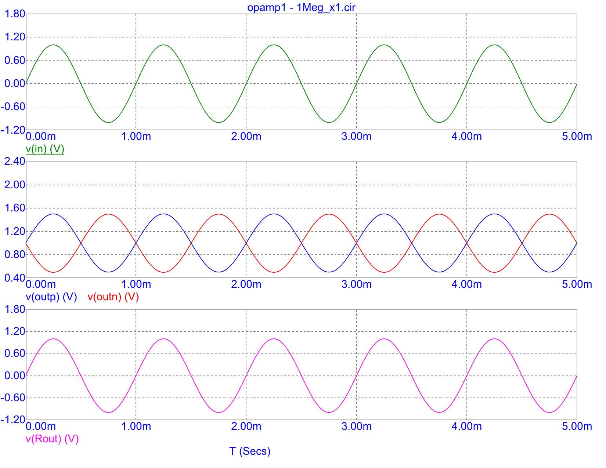 | 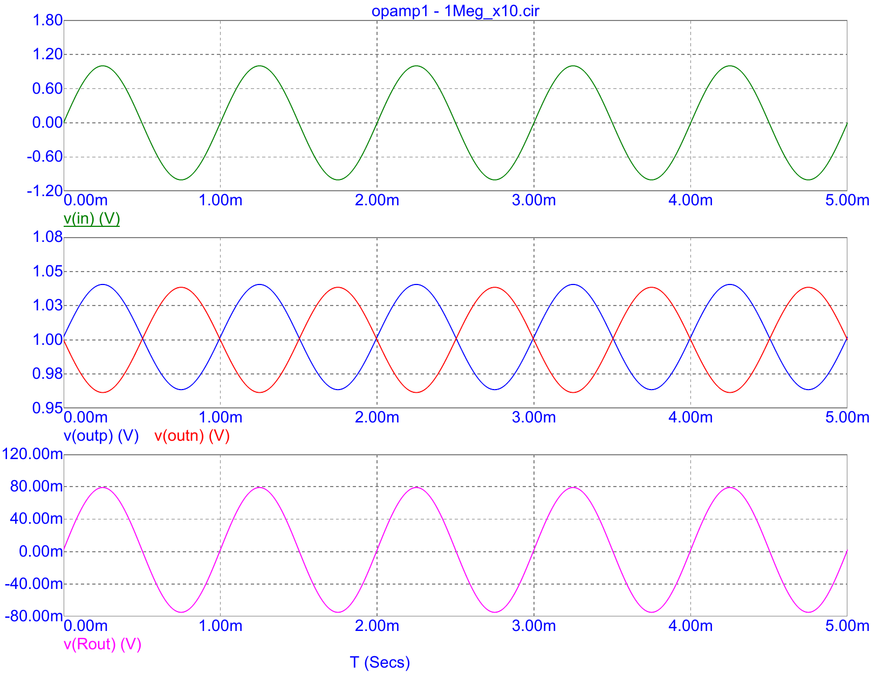 |

Circuit files are in [`Sim/`](Sim/).

## PC application

A simple Windows app (C# WinForms, source in [`Firmware/APP/`](Firmware/APP/); open `Osciloskop_software.sln` in Visual Studio) that works like a serial plotter: pick the COM port, press **OPEN**, and set the time base and V/div for each channel.

| Sine (5 ms/div) | Two sines, phase shift (8 µs/div) |
|---|---|
| 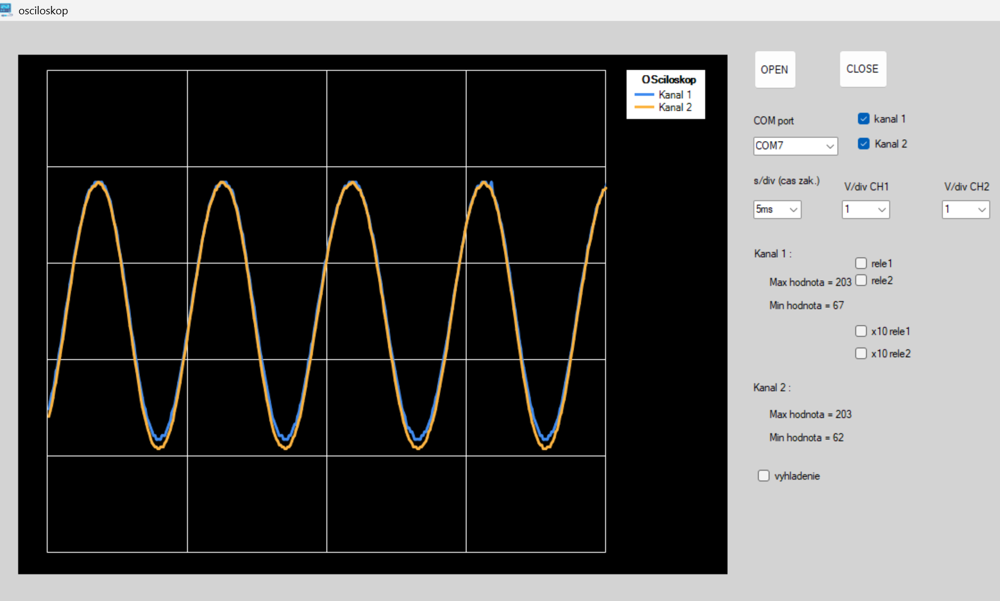 | 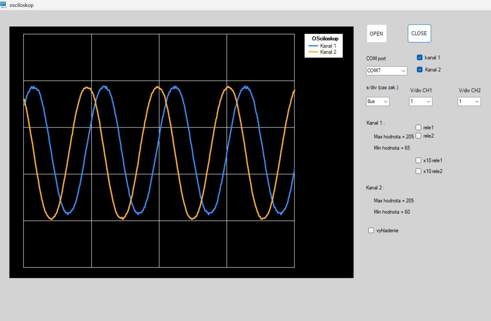 |
| **Sine, different V/div** | **Triangle** |
| 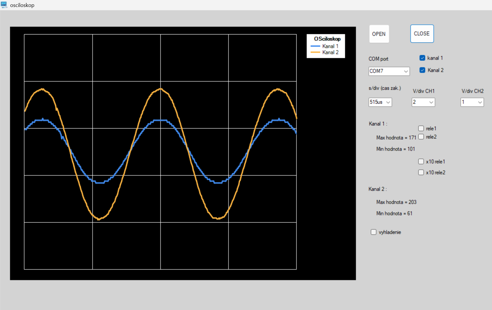 | 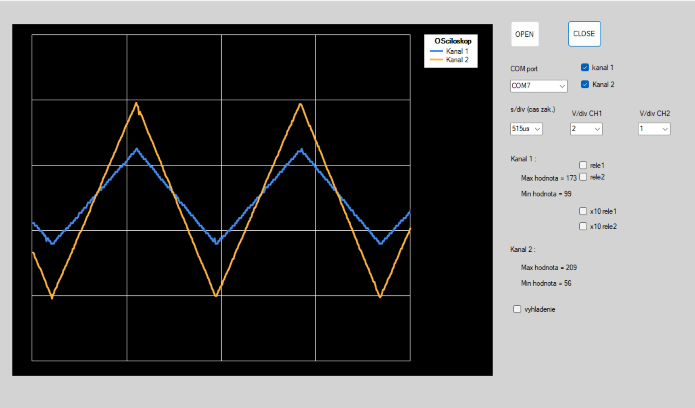 |
| **Square wave** | **Linearity test** |
| 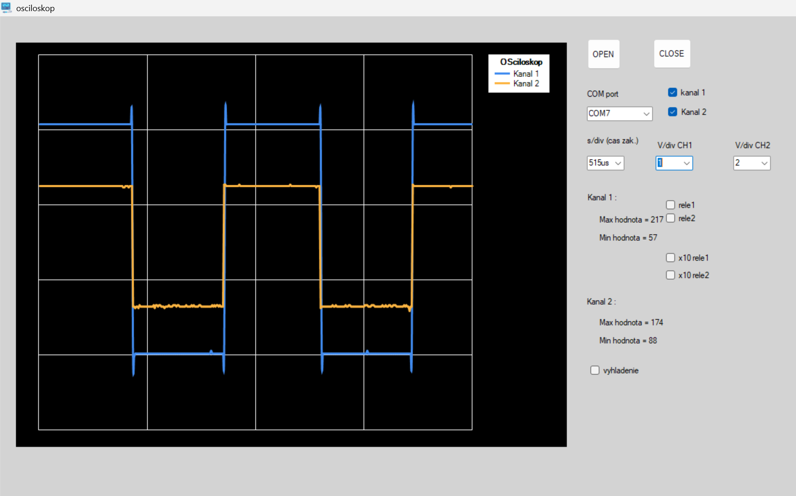 | 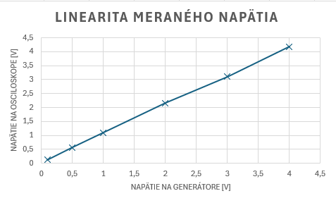 |

The linearity test compares the voltage set on a signal generator with the voltage measured by the oscilloscope (0–4 V).

## Repository

| Folder | Contents |
|---|---|
| `PCBs/` | Altium projects, schematics and assembly drawings (V01, V02) |
| `Firmware/EPS32/` | ESP32 firmware (ESP-IDF) |
| `Firmware/APP/` | Windows app for viewing the signal (C#, Visual Studio) |
| `Sim/` | SPICE simulations of the input stage |
| `Doc/` | Full documentation and presentation (in Slovak) |

## Build the firmware

Needs [ESP-IDF](https://docs.espressif.com/projects/esp-idf/en/latest/esp32s3/get-started/).

```bash
cd Firmware/EPS32
idf.py set-target esp32s3
idf.py build flash monitor
```

## Documentation

- [Full documentation (SK)](Doc/SOC_Documentation.pdf)
- [Presentation (SK)](Doc/SOC_Presentation.pdf)

## Authors

Jakub Bohunický, Ondrej Peter, Peter Bódi
